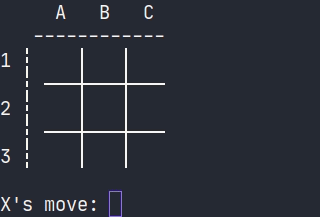

# Build a Tic-Tac-Toe Game Engine With an AI Player in Python

This is a companion project to a Real Python [tutorial](https://realpython.com/tic-tac-toe-ai-python/) about implementing a game engine using the minimax algorithm as rudimentary artificial intelligence. It consists of two elements:

1. Game Engine Library
2. Game Front Ends

---

## _Game Engine Library_


The underlying game logic is encapsulated in a common library, which can be reused across multiple [game front ends](#game-front-ends) without duplicating the code.

> ### Installing

Before proceeding, make sure you've created a virtual environment, activated it, and installed the tic-tac-toe game engine library into it:

```shell
$ cd tic-tac-toe/
$ python -m venv venv/
$ source venv/bin/activate
(venv) $ python -m pip install library/
```
_For windows command line virtual envirnment can be activated as follow:_

```shell
C:\Users>.\venv\Scripts\activate
```

This will let you test the game front ends provided by this project.

> ### Packaging

One of the available game front ends relies on the library distributed as a Python wheel. Therefore, you must build and package the library accordingly:

```shell
$ cd tic-tac-toe/
$ python -m pip wheel library/
$ mv tic_tac_toe-1.0.0-py3-none-any.whl frontends/browser/
```

Note that you don't need a virtual environment for these commands to work, but running them in one is completely fine.

## _Game Front Ends_

There are a few game front ends implemented in separate packages for you to try out. Before running them, make sure you've followed the earlier steps just described. Now, change the directory to the game front ends parent folder:

```shell
$ cd tic-tac-toe/frontends/
```

> ### Browser Front End

Play tic-tac-toe in your web browser through PyScript:

```shell
$ python -m browser
```

This will start a local HTTP server and open the hosted HTML file in your web browser. Note that you don't need to create a virtual environment or install the game engine library to play the game because it's loaded dynamically from a Python wheel file.

Sample gameplay:


> ### Console Front End

Play tic-tac-toe in the terminal:

```shell
(venv) $ python -m console
```

You can optionally set one or both players to a human player (`human`), a computer player making random moves (`random`), or an unbeatable minimax computer player (`minimax`), as well as change the starting player:

```shell
(venv) $ python -m console -X minimax -O random --starting O
```

Sample gameplay:



> ### Window Front End

Play tic-tac-toe against a minimax computer player in a GUI application built with Tkinter:

```shell
(venv) $ python -m window
```

To change the players, who are currently hard-coded, you'll need to edit the following fragment of the front end's code:

```python
def game_loop(window: Window, events: Queue) -> None:
    player1 = WindowPlayer(Mark("X"), events)
    player2 = MinimaxComputerPlayer(Mark("O"))
    starting_mark = Mark("X")
    TicTacToe(player1, player2, WindowRenderer(window)).play(starting_mark)
```

Sample gameplay:


